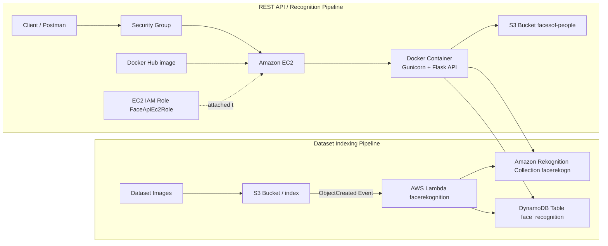

# Face_rekognition
A simple face rekognition using Amazon rekognitionand other amazon services 
# Cloud-Based Face Recognition API

# Basic Architecture


*Architecture diagram of the cloud-based face recognition system showing the EC2-hosted Dockerized Flask API, S3-triggered Lambda indexing workflow, Rekognition collection, and DynamoDB storage.*

A cloud-based face recognition project built with **Flask**, **Docker**, **AWS Lambda**, **Amazon S3**, **Amazon Rekognition**, **Amazon DynamoDB**, **Docker Hub**, and **Amazon EC2**.

This project combines two connected workflows:

1. **Dataset indexing pipeline**  
   Images uploaded to S3 are processed automatically by **AWS Lambda**, indexed in **Amazon Rekognition**, and stored in **DynamoDB**.

2. **REST API pipeline**  
   A **Flask API** running inside a **Docker container** on **EC2** exposes endpoints for:
   - health check
   - face registration
   - face recognition

---

## Live Endpoint

Current deployed EC2 base URL:

```bash
http://34.244.117.63:5000
```

Endpoints:

```bash
GET  http://34.244.117.63:5000/
POST http://34.244.117.63:5000/register
POST http://34.244.117.63:5000/recognize
```

> **Note:** This endpoint uses the EC2 public IP captured during deployment. If the instance is restarted without an Elastic IP, the public IP may change.

---

## Architecture Overview



---

## Tech Stack

- **Backend:** Flask, Gunicorn
- **Language:** Python
- **Containerization:** Docker
- **Cloud Compute:** Amazon EC2
- **Storage:** Amazon S3
- **Face Recognition:** Amazon Rekognition
- **Database:** Amazon DynamoDB
- **Event Processing:** AWS Lambda
- **Monitoring:** Amazon CloudWatch
- **API Testing:** Postman
- **Container Registry:** Docker Hub

---

## AWS Resources Used

- **S3 Bucket:** `facesof-people`
- **Rekognition Collection:** `facerekogn`
- **DynamoDB Table:** `face_recognition`
- **Lambda Function:** `facerekognition`
- **Lambda Role:** `face_rekognition`
- **EC2 Role:** `FaceApiEc2Role`

---

## API Endpoints

### `GET /`
Checks whether the API is running.

**Example**
```bash
GET http://127.0.0.1:5000/
```

**Response**
```json
{
  "message": "Face Recognition API is running"
}
```

---

### `POST /register`
Registers a new face.

**Form-data**
- `full_name` → text
- `image` → file

**Example**
```bash
POST http://127.0.0.1:5000/register
```

**Sample Response**
```json
{
  "FaceId": "db78103b-9afc-456f-b5f2-0446dcbaafe4",
  "FullName": "Justin Bieber",
  "ImageKey": "registered/cc38a74d-29d1-4e86-a753-23c1d1dc3f74_Justin.jpg",
  "message": "Face registered successfully"
}
```

---

### `POST /recognize`
Recognizes a face from an uploaded image.

**Form-data**
- `image` → file

**Example**
```bash
POST http://127.0.0.1:5000/recognize
```

**Sample Response**
```json
{
  "Bucket": "facesof-people",
  "FaceId": "db78103b-9afc-456f-b5f2-0446dcbaafe4",
  "FullName": "Justin Bieber",
  "ImageKey": "registered/cc38a74d-29d1-4e86-a753-23c1d1dc3f74_Justin.jpg",
  "SearchImageKey": "search/94edac3e-9df8-4b04-a08a-336fc8cec4c1_download (2).jpg",
  "Similarity": 99.99227905273438,
  "message": "Match found"
}
```

---

## How It Works

### Indexing pipeline
1. Dataset images are uploaded into the `index/` folder in S3.
2. S3 triggers the Lambda function `facerekognition`.
3. Lambda calls Rekognition to index faces into the collection `facerekogn`.
4. Lambda stores the generated face metadata in DynamoDB.

### API pipeline
1. A client sends requests to the Flask API.
2. The API runs inside Docker on an EC2 instance.
3. For registration and recognition requests, the API interacts with:
   - S3 for image storage
   - Rekognition for face comparison
   - DynamoDB for metadata retrieval

---

## Local Setup

### 1. Clone the repository
```bash
git clone https://github.com/oluwatoni04/Face_rekognition.git
cd Face_rekognition
```

### 2. Create a virtual environment
```bash
python -m venv .venv
```

### 3. Activate the environment

**Windows**
```bash
.venv\Scripts\activate
```

**macOS / Linux**
```bash
source .venv/bin/activate
```

### 4. Install dependencies
```bash
pip install -r requirements.txt
```

### 5. Create `.env`
```env
AWS_REGION=eu-west-1
S3_BUCKET=facesof-people
COLLECTION_ID=facerekogn
DYNAMODB_TABLE=face_recognition
```

### 6. Run locally
```bash
python app.py
```

---

## Run with Docker

### Build
```bash
docker build -t face-api .
```

### Run locally
```bash
docker run --env-file .env -e AWS_PROFILE=default -v "C:\Users\toniu\.aws:/root/.aws:ro" -p 5000:5000 face-api
```

---

## Deploy to EC2

### Pull on EC2
```bash
docker pull oluwatoni04/face-api:v1
```

### Run on EC2
```bash
docker run -d --name face-api-container --env-file .env -p 5000:5000 oluwatoni04/face-api:v1
```

---

## Security Notes

- Do not commit `.env`
- Do not commit `.pem` files
- Do not commit AWS access keys
- Use IAM roles for AWS access in production
- Restrict EC2 inbound rules to your IP during testing

---

## Troubleshooting Highlights

- Fixed Docker build issues caused by dependency filename mismatch
- Fixed missing AWS credentials inside Docker during local testing
- Resolved Docker Hub image tag / auth issues on EC2
- Excluded `.venv` from Git tracking
- Resolved Git push conflict caused by remote history mismatch


## 1. Local API Testing with Postman

### Health check endpoint
`Screenshot 2026-04-14 194300.png`


### Register endpoint
`Screenshot 2026-04-14 195103.png`


### Recognize endpoint
`Screenshot 2026-04-14 195350.png`


### Additional local recognition result
`Screenshot 2026-04-14 194135.png`


### Dockerized API credentials error
`Screenshot 2026-04-15 113324.png`


### Dockerized register success
`Screenshot 2026-04-15 113737.png`


### Dockerized recognize success
`Screenshot 2026-04-15 114033.png`


---

## 2. AWS Console, Account Context, and IAM Setup

### AWS Console home
`Screenshot 2026-04-14 200340.png`


### Alternate console / region context
`Screenshot 2026-04-14 201534.png`


### Session controls / multi-session state
`Screenshot 2026-04-14 201602.png`


### IAM dashboard
`Screenshot 2026-04-14 201811.png`


### IAM user group list
`Screenshot 2026-04-14 201839.png`


### Admin group summary
`Screenshot 2026-04-14 201858.png`


### Admin group permissions
`Screenshot 2026-04-14 201937.png`


### IAM dashboard as `Toni_dev`
`Screenshot 2026-04-14 202002.png`


### AWS console home in target region
`Screenshot 2026-04-14 202457.png`


---

## 3. Lambda Role and Permission Policy

### IAM roles list with Lambda role
`Screenshot 2026-04-14 202016.png`


### Lambda role summary
`Screenshot 2026-04-14 202030.png`


### Lambda inline policy attached
`Screenshot 2026-04-14 202054.png`


### Lambda policy JSON editor
`Screenshot 2026-04-14 202209.png`


### Lambda policy visual editor
`Screenshot 2026-04-14 202351.png`


### Lambda permissions summary view
`Screenshot 2026-04-14 202844.png`


---

## 4. Lambda Function, Trigger, and Monitoring

### Lambda functions list
`Screenshot 2026-04-14 202646.png`


### Lambda function overview
`Screenshot 2026-04-14 202708.png`


### Lambda function code editor
`Screenshot 2026-04-14 202728.png`


### Lambda S3 trigger
`Screenshot 2026-04-14 202819.png`


### CloudWatch log group
`Screenshot 2026-04-14 202902.png`


---

## 5. S3 Bucket and Folder Structure

### S3 bucket list
`Screenshot 2026-04-14 203008.png`


### Bucket folders: index / registered / search
`Screenshot 2026-04-14 203019.png`


### Indexed images in `index/`
`Screenshot 2026-04-14 203032.png`


---

## 6. DynamoDB Table and Data

### DynamoDB tables list
`Screenshot 2026-04-14 203101.png`


### Table details
`Screenshot 2026-04-14 203114.png`


### PartiQL query editor
`Screenshot 2026-04-14 203125.png`


### Query results / indexed records
`Screenshot 2026-04-14 203138.png`


---

## 7. Docker Local Build and Troubleshooting

### Docker build and local run
`Screenshot 2026-04-15 112346.png`


### Worker timeout / request handling issue
`Screenshot 2026-04-15 114058.png`


---

## 8. Docker Hub Publishing

### Docker Hub home / repository section
`Screenshot 2026-04-15 115234.png`


### Docker Hub repository page
`Screenshot 2026-04-15 120138.png`


### Docker Desktop "My Hub"
`Screenshot 2026-04-15 120234.png`


### Tagging and pushing image
`Screenshot 2026-04-15 120508.png`


---

## 9. EC2 IAM Role and Policy

### Role list showing `FaceApiEc2Role`
`Screenshot 2026-04-15 121006.png`


### EC2 role summary
`Screenshot 2026-04-15 121015.png`


### EC2 role policy JSON
`Screenshot 2026-04-15 121034.png`


### EC2 role policy visual editor
`Screenshot 2026-04-15 121043.png`


---

## 10. Launching the EC2 Instance

### EC2 launch wizard (x86 / t3.micro)
`Screenshot 2026-04-15 121345.png`


### Creating the key pair
`Screenshot 2026-04-15 121451.png`


### Initial ARM/t4g instance mismatch view
`Screenshot 2026-04-15 121839.png`


### Corrected x86 selection
`Screenshot 2026-04-15 121854.png`


### Network settings view
`Screenshot 2026-04-15 122045.png`


### Security group inbound rule
`Screenshot 2026-04-15 122210.png`


---

## 11. SSH Access and Docker on EC2

### First SSH authenticity prompt
`Screenshot 2026-04-15 122549.png`


### Successful SSH login
`Screenshot 2026-04-15 123825.png`


### EC2 shell prompt view
`Screenshot 2026-04-15 123908.png`


### Docker version on EC2
`Screenshot 2026-04-15 125528.png`


### Pulling Docker image on EC2
`Screenshot 2026-04-15 125538.png`


### Running container on EC2
`Screenshot 2026-04-15 130109.png`


### Container logs and running status
`Screenshot 2026-04-15 130442.png`


---

## 12. Git and GitHub Troubleshooting

### Git tracking `.venv`
`Screenshot 2026-04-15 130556.png`


### Git push rejected because remote already had history
`Screenshot 2026-04-16 114146.png`


### Merge commit editor
`Screenshot 2026-04-16 114836.png`


### Additional Git/GitHub step
`Screenshot 2026-04-16 115013.png`


---

## Project Structure

```text
.
├── app.py
├── main.py
├── test.py
├── Dockerfile
├── .dockerignore
├── requirements.txt
├── README.md
└── images/
```

---

## What I Learned

This project helped me gain practical experience with:

- IAM users, groups, roles, and policies
- S3-triggered Lambda functions
- Rekognition face indexing and matching
- DynamoDB table setup and querying
- Flask API design
- Docker containerization
- Docker Hub publishing
- EC2 deployment
- SSH access and Linux-based server administration
- debugging real cloud deployment issues end to end

---

## Future Improvements

- Add a frontend UI for uploads and results
- Add attendance logging
- Add unknown-face handling
- Add Nginx as a reverse proxy
- Add HTTPS and a custom domain
- Use an Elastic IP for a stable public endpoint
- Add a final architecture diagram export

---

## Author

**Oluwatoni Ajaka**

- GitHub: [oluwatoni04](https://github.com/oluwatoni04)
- LinkedIn: [oluwatoni-ajaka-b3952a3b0](https://www.linkedin.com/in/oluwatoni-ajaka-b3952a3b0/)
- Email: `toniajaka06@gmail.com`

---

## Portfolio Summary

> Built and deployed a cloud-based face recognition API using Flask, Docker, AWS Lambda, S3, Rekognition, DynamoDB, Docker Hub, and EC2. The system supports automatic dataset indexing through S3-triggered Lambda functions and live face registration / recognition through REST API endpoints.
