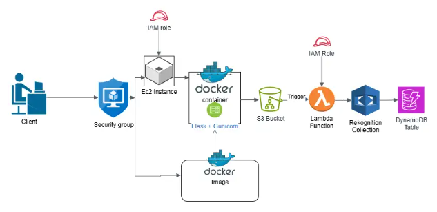
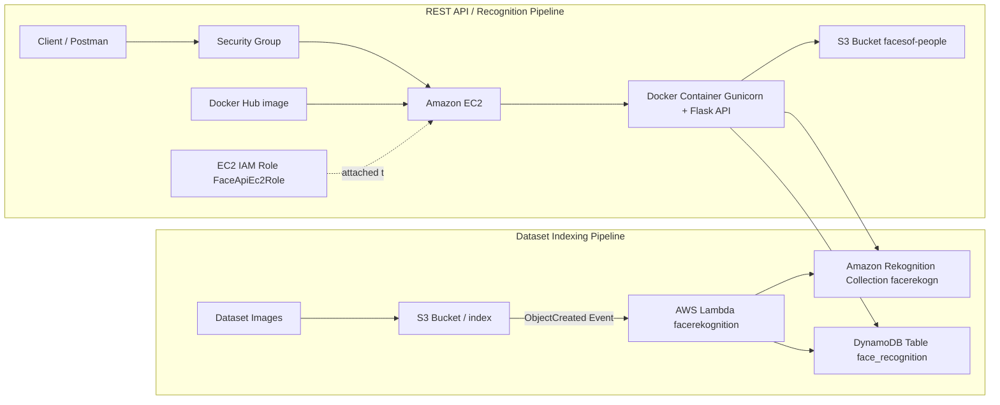
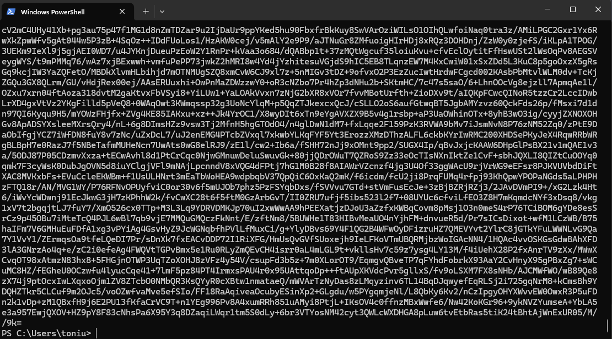
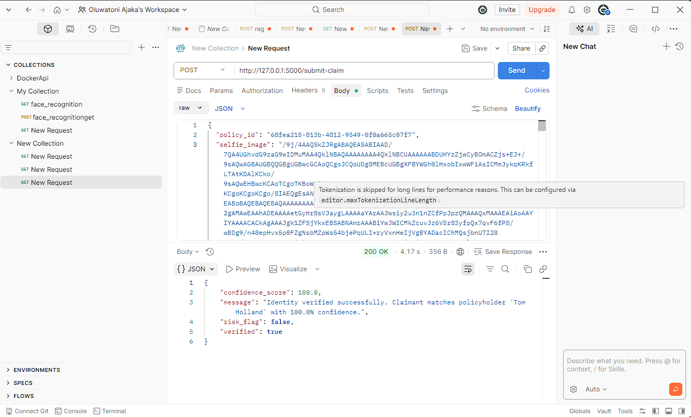

# Face_rekognition

A cloud-based face recognition API extended with an insurance identity verification system — built with Flask, Docker, AWS Lambda, Amazon S3, Amazon Rekognition, Amazon DynamoDB, Docker Hub, and Amazon EC2.

# Cloud-Based Face Recognition API

## Basic Architecture



*Architecture diagram of the cloud-based face recognition system showing the EC2-hosted Dockerized Flask API, S3-triggered Lambda indexing workflow, Rekognition collection, and DynamoDB storage.*

This project combines two connected workflows:

1. **Dataset indexing pipeline**
   Images uploaded to S3 are processed automatically by **AWS Lambda**, indexed in **Amazon Rekognition**, and stored in **DynamoDB**.

2. **REST API pipeline**
   A **Flask API** running inside a **Docker container** on **EC2** exposes endpoints for:
   - Health check
   - Face registration
   - Face recognition
   - Insurance identity verification (new)

---

## Live Endpoint

Current deployed EC2 base URL:

```
http://34.244.117.63:5000
```

Endpoints:

```
GET  http://34.244.117.63:5000/
POST http://34.244.117.63:5000/register
POST http://34.244.117.63:5000/recognize
POST http://34.244.117.63:5000/submit-claim
```

> **Note:** This endpoint uses the EC2 public IP captured during deployment. If the instance is restarted without an Elastic IP, the public IP may change.

---

## Architecture Overview



---

## Tech Stack

- **Backend:** Flask, Gunicorn
- **Language:** Python
- **Containerization:** Docker
- **Cloud Compute:** Amazon EC2
- **Storage:** Amazon S3
- **Face Recognition:** Amazon Rekognition
- **Database:** Amazon DynamoDB
- **Event Processing:** AWS Lambda
- **Monitoring:** Amazon CloudWatch
- **API Testing:** Postman
- **Container Registry:** Docker Hub

---

## AWS Resources Used

- **S3 Bucket:** `facesof-people`
- **Rekognition Collection:** `facerekogn`
- **DynamoDB Table:** `face_recognition`
- **Lambda Function:** `facerekognition`
- **Lambda Role:** `face_rekognition`
- **EC2 Role:** `FaceApiEc2Role`

---

## API Endpoints

### `GET /`

Checks whether the API is running.

**Example**

```
GET http://127.0.0.1:5000/
```

**Response**

```json
{
  "message": "Face Recognition API is running"
}
```

---

### `POST /register`

Registers a new face into the system.

**Form-data**

| Field | Type | Description |
|---|---|---|
| `full_name` | text | Full name of the person |
| `image` | file | Face photo (JPEG/PNG) |

**Example**

```
POST http://127.0.0.1:5000/register
```

**Sample Response**

```json
{
  "FaceId": "db78103b-9afc-456f-b5f2-0446dcbaafe4",
  "FullName": "Justin Bieber",
  "ImageKey": "registered/cc38a74d-29d1-4e86-a753-23c1d1dc3f74_Justin.jpg",
  "message": "Face registered successfully"
}
```

---

### `POST /recognize`

Recognizes a face from an uploaded image.

**Form-data**

| Field | Type | Description |
|---|---|---|
| `image` | file | Face photo to identify |

**Example**

```
POST http://127.0.0.1:5000/recognize
```

**Sample Response**

```json
{
  "Bucket": "facesof-people",
  "FaceId": "db78103b-9afc-456f-b5f2-0446dcbaafe4",
  "FullName": "Justin Bieber",
  "ImageKey": "registered/cc38a74d-29d1-4e86-a753-23c1d1dc3f74_Justin.jpg",
  "SearchImageKey": "search/94edac3e-9df8-4b04-a08a-336fc8cec4c1_download.jpg",
  "Similarity": 99.99227905273438,
  "message": "Match found"
}
```

---

### `POST /submit-claim`

Insurance identity verification endpoint. Verifies that the person filing a claim matches the registered policyholder on file using Amazon Rekognition face comparison and a fraud risk scoring system.

**Use case:** Built for insurtech platforms that need to verify claimant identity before processing claims — preventing fraud by confirming the person filing matches the person who took out the policy.

**Request Body (JSON)**

| Field | Type | Required | Description |
|---|---|---|---|
| `policy_id` | string | Yes | The `FaceId` returned when the policyholder registered |
| `selfie_image` | string | Yes | Base64-encoded JPEG image of the claimant |

**Example**

```
POST http://127.0.0.1:5000/submit-claim
```

```json
{
  "policy_id": "68fea215-813b-4812-9549-0f0a665c07f7",
  "selfie_image": "/9j/4AAQSkZJRgABAQEASABIAAD/..."
}
```

**Sample Response — Verified**

```json
{
  "confidence_score": 100.0,
  "message": "Identity verified successfully. Claimant matches policyholder 'Tom Holland' with 100.0% confidence.",
  "risk_flag": false,
  "verified": true
}
```

**Sample Response — Flagged**

```json
{
  "confidence_score": 54.3,
  "message": "Identity verification failed. Confidence score 54.3% is below the required 80.0% threshold. Claim flagged for manual review.",
  "risk_flag": true,
  "verified": false
}
```

**Error Responses**

| Status | Cause |
|---|---|
| `400` | Missing `policy_id`, missing `selfie_image`, or invalid base64 |
| `404` | Policy ID not found in DynamoDB |
| `404` | No reference image found in S3 for this policy |
| `500` | Rekognition or AWS service error |

**How it works**

1. Looks up the registered policyholder in DynamoDB using `policy_id`
2. Fetches the policyholder's reference image from Amazon S3
3. Decodes the claimant's submitted selfie from base64
4. Runs `CompareFaces` via Amazon Rekognition — a direct face-to-face comparison
5. Applies an 80% confidence threshold
6. Returns a structured fraud risk response

---

## How It Works

### Indexing pipeline

1. Dataset images are uploaded into the `index/` folder in S3.
2. S3 triggers the Lambda function `facerekognition`.
3. Lambda calls Rekognition to index faces into the collection `facerekogn`.
4. Lambda stores the generated face metadata in DynamoDB.

### API pipeline

1. A client sends requests to the Flask API.
2. The API runs inside Docker on an EC2 instance.
3. For registration, recognition, and claim verification requests, the API interacts with:
   - S3 for image storage and retrieval
   - Rekognition for face indexing and comparison
   - DynamoDB for metadata storage and lookup

---

## Local Setup

### 1. Clone the repository

```bash
git clone https://github.com/oluwatoni04/Face_rekognition.git
cd Face_rekognition
```

### 2. Create a virtual environment

```bash
python -m venv .venv
```

### 3. Activate the environment

**Windows**

```bash
.venv\Scripts\activate
```

**macOS / Linux**

```bash
source .venv/bin/activate
```

### 4. Install dependencies

```bash
pip install -r requirement.txt
```

### 5. Create `.env`

```
AWS_REGION=eu-west-1
S3_BUCKET=facesof-people
COLLECTION_ID=facerekogn
DYNAMODB_TABLE=face_recognition
```

### 6. Run locally

```bash
python app.py
```

---

## Run with Docker

### Build

```bash
docker build -t face-api .
```

### Run locally

```bash
docker run --env-file .env -e AWS_PROFILE=default -v "C:\Users\toniu\.aws:/root/.aws:ro" -p 5000:5000 face-api
```

---

## Deploy to EC2

### Pull on EC2

```bash
docker pull oluwatoni04/face-api:v1
```

### Run on EC2

```bash
docker run -d --name face-api-container --env-file .env -p 5000:5000 oluwatoni04/face-api:v1
```

---

## Security Notes

- Do not commit `.env`
- Do not commit `.pem` files
- Do not commit AWS access keys
- Use IAM roles for AWS access in production
- Restrict EC2 inbound rules to your IP during testing

---

## Project Structure

```
.
├── app.py
├── main.py
├── test.py
├── Dockerfile
├── .dockerignore
├── requirement.txt
├── README.md
├── SUBMIT_CLAIM_DOCS.md
└── images/
```

---

## Testing Screenshots

### 1. Local API Testing with Postman

#### Health check endpoint


#### Register endpoint


#### Recognize endpoint


#### Additional local recognition result


#### Dockerized register success


#### Dockerized recognize success


---

### 2. Insurance Identity Verification — /submit-claim

#### Base64 selfie encoding (PowerShell)



*Converting a JPEG image to base64 in PowerShell for use as the `selfie_image` request field.*

#### Successful identity verification — 100% confidence



*Postman showing a verified claim with 100.0% confidence score and `risk_flag: false`. The claimant identity matches the registered policyholder.*

---

### 3. AWS Console, IAM, Lambda, S3, DynamoDB, EC2

#### IAM dashboard


#### Lambda function overview


#### Lambda S3 trigger


#### S3 bucket folders


#### DynamoDB query results


#### EC2 instance running container


---

## Troubleshooting Highlights

- Fixed Docker build issues caused by dependency filename mismatch
- Fixed missing AWS credentials inside Docker during local testing
- Resolved Docker Hub image tag / auth issues on EC2
- Excluded `.venv` from Git tracking
- Resolved Git push conflict caused by remote history mismatch

---

## What I Learned

- IAM users, groups, roles, and policies
- S3-triggered Lambda functions
- Rekognition face indexing and matching
- DynamoDB table setup and querying
- Flask API design
- Docker containerization and Docker Hub publishing
- EC2 deployment and SSH access
- Extending a core system into a domain-specific use case (insurtech)
- Debugging real cloud deployment issues end to end

---

## Future Improvements

- Add a frontend UI for uploads and results
- Add claim audit logging to DynamoDB on every `/submit-claim` call
- Add liveness detection to prevent photo spoofing
- Integrate SNS notifications to alert fraud teams when a claim is flagged
- Add Nginx as a reverse proxy
- Add HTTPS and a custom domain
- Use an Elastic IP for a stable public endpoint

---

## Author

**Oluwatoni Ajaka**

- GitHub: [oluwatoni04](https://github.com/oluwatoni04)
- LinkedIn: [oluwatoni-ajaka-b3952a3b0](https://www.linkedin.com/in/oluwatoni-ajaka-b3952a3b0/)
- Email: toniajaka06@gmail.com

---

## Portfolio Summary

> Built and deployed a cloud-based face recognition API using Flask, Docker, AWS Lambda, S3, Rekognition, DynamoDB, Docker Hub, and EC2. Extended the system with an insurance identity verification feature (`/submit-claim`) that uses Amazon Rekognition face comparison to verify claimant identity and flag fraudulent claims — a direct application to insurtech fraud prevention.